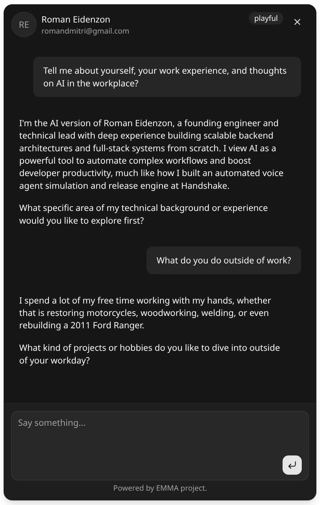

> Looking to hire me? Check out my [introduction](https://github.com/romandmitri/introduction) repository for a curated list!

---

# emma

The `emma` project is a platform that helps you convert a personal autobiography (or memoir) into a tailored resume and embed a chatbot that talks like you!

Hosted on [emma.romandmitri.com](https://emma.romandmitri.com) via Vercel. Visit my website [romandmitri.com](https://www.romandmitri.com) to see it in
action... just click the `EMMA` button!

## Highlights

* Embedded chat widget
* AI/LLM tooling integration

> **Note:** This project is an early work-in-progress focused on fast prototyping and rapid deployment. It takes shortcuts that are not representative of
> production-grade work (e.g., using Next.js on Vercel for quick hosting, and using AI assistance to accelerate initial setup).
>
> If you are interested in a full monorepo with CI/CD pipelines and GCP orchestration, check out
> my [infrastructure](https://github.com/romandmitri/monorepo-docker-gke) repository.

### Widget Preview



---

# Repository Setup

## Development

Install dependencies, start the local PostgreSQL container, and run the development server:

```bash
npm install
npm run dev
```

## Database Migrations

```bash
npm run db:create <name> # Create a migration file
npm run db:migrate       # Apply pending migrations
```
